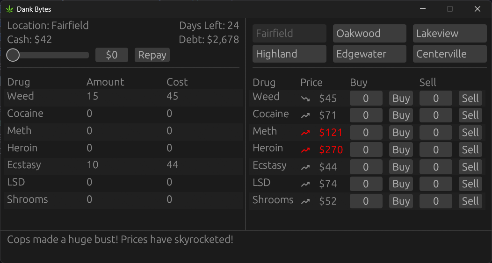

<h1 align="center">Dank Bytes</h1>


<p align="center">
  
  
  <a href="https://github.com/alefnull/dankbytes/releases/latest" style="text-decoration: none">
    
  </a>
</p>

[](https://ko-fi.com/E1E11F8P04)

## About ##

A sloppy WIP Rust 'clone' of an old game i played back on Windows 98 or XP, called "Dope Wars"



## Features

- 🎲 random events and price fluctuations
- 💼 buy low, sell high
- 🌆 multiple locations (currently not unique, but hoping to change that)
- 💰 make as much money as possible before time runs out
- 🎮 simple GUI using egui

## Crates Used ##
```
eframe = "0.31.1"
egui_extras = "0.31.1"
rand = "0.9.1"
thousands = "0.2.0"
```

## Contributing

Feel free to:
- Report bugs
- Suggest features
- Submit pull requests

## Development

Requirements:
- Rust stable
- Cargo

```bash
# Clone the repository
git clone https://github.com/alefnull/dankbytes.git
cd dankbytes

# Build
cargo build --release

# Run
cargo run --release
```

## License ##

This project is under license from MIT. For more details, see the [LICENSE](LICENSE) file.
